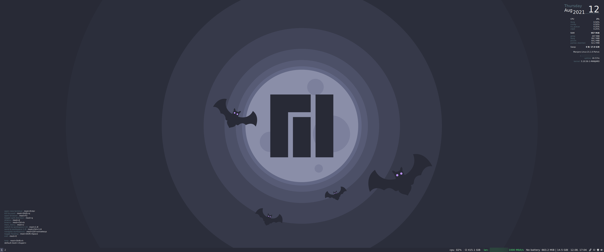
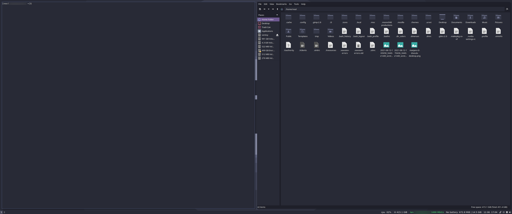

# Manjaro i3 Dracula
This repo contains the files & configs needed to reskin Manjaro i3 with [Dracula](https://draculatheme.com/) theming (including dunst, bmenu, morc_menu).

Once updated it should look something like this:

## Installation
- First, obviously, install [Manjaro i3](https://manjaro.org/downloads/community/i3/)
- I'd suggest making backups of the default configs in case something goes wrong or you want to revert the look. For example, running the following in terminal:
	- `mv ~/.i3/config ~/.i3/config.bk`
	- `mv ~/.config/dunst/dunstrc ~/.config/dunst/dunstrc.bk`
	- `mv ~/.dir_colors ~/.dir_colors.bk`
	- `mv ~/.dmenurc ~/.dmenurc.bk`
	- `mv ~/.Xresources ~/.Xresources.bk`
- Clone this repo:
	- `git clone https://github.com/nealbrophy/manjaro-i3-dracula`
- Copy the configs as follows (if you're using a file manager and can't see the following files, make sure you're viewing hidden files (`Ctrl+h`):
	- `.dir_colors`, `.dmenurc`, `.Xresources` should be copied from `<this repo>/move_to_home/` folder to your home directory (`~` or `$HOME`)
	- `config` should be copied from `<this repo>/i3/` folder to `~/.i3/`
	- `dunstrc` should be copied from `<this repo>/move_to_.config/dunst/` to `~/.config/dunst/`
	- `config` should be copied from `<this repo>/move_to_.config/i3status/` to `~/.config/i3status/` (you may need to create this folder, `mkdir ~/.config/i3status`)
	- Grab the [Dracula GTK files](https://draculatheme.com/gtk) (including the icons)
		- Extract the `gtk-master.zip` GKT-theme folder and copy to `~/.themes/` (just create the themes folder in your home dir if it doesn't already exist)
		- Extract the `Dracula.zip` icons folder and copy to `~/.icons/` (create icons folder in home if not already there)
		- Launch `lxappearance` and select the themes in the `Widget` and `Icon Theme` tabs, apply
	- Grab the [Dracula Wallpapers](https://draculatheme.com/wallpaper) and save the Manjaro variant somewhere you'll remember
		- Launch `nitrogen`, click `Preferences` and add the directory you saved the wallpaper to, click OK etc
		- select `manjaro.png` and click `Apply`

## Credits
- [Dracula](https://draculatheme.com/) theme is by Zeno Rocha and lots of lovely contributors. You should [buy Pro](https://draculatheme.com/pro) to support his work.
- [Manjaro](https://manjaro.org/) is excellent and you should support them on [OpenCollective](https://opencollective.com/manjaro/donate)
- `.dir_colors` file is from Josh Benham's repo [here](https://github.com/joshbenham/linux-dotfiles/blob/master/dircolors/Dracula.dircolors)